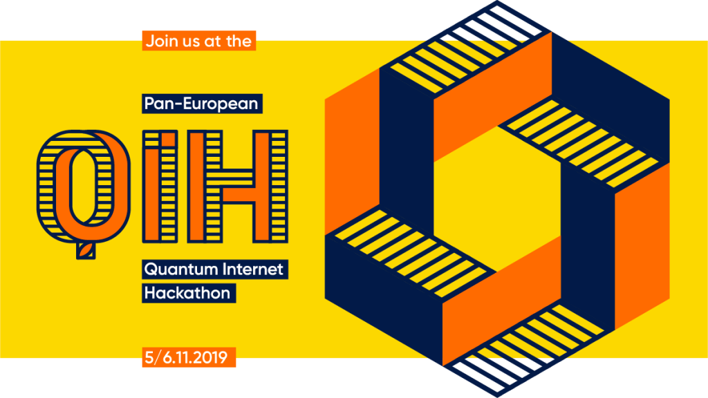

# The pan-European quantum Internet hackathon

On 5 and 6 November 2019 I ([Bruno Rijsman](https://www.linkedin.com/in/brunorijsman/)) took part in the [Pan-European Quantum Internet Hackathon](https://labs.ripe.net/Members/ulka_athale_1/take-part-in-pan-european-quantum-internet-hackathon) organized by [RIPE labs](https://labs.ripe.net/).

Participants from six geographically distributed locations (Delft, Dublin, Geneva, Padua, Paris, and Sarajevo) formed teams that worked on various projects related to the [Quantum Internet](https://qutech.nl/wp-content/uploads/2018/10/Quantum-internet-A-vision.pdf).

I participated in Delft where the hackathon was hosted by [QuTech](https://qutech.nl/), a world-leading quantum technology research and development office within the [Delft University of Technology](https://www.tudelft.nl/).

# The OpenSSL integration challenge

In Delft, I joined [Yvo Keuter](https://www.linkedin.com/in/yvo-keuter-6794932/) and [Tim Janssen](https://www.linkedin.com/in/timjanssen89/) to form a team working on one of the [challenges suggested by the hackathon organizers](https://github.com/PEQI19/challenges), namely the [OpenSSL integration challenge](https://github.com/PEQI19/PEQI-OpenSSL).

This challenge was developed by [Wojciech Kozlowski](https://www.linkedin.com/in/wojciech-kozlowski/), a postdoctoral researcher at [QuTech](https://qutech.nl/) and one of the organizers of the Delft hackathon. He is also the main author of the [Architectural Principles of the Quantum Internet](https://datatracker.ietf.org/doc/draft-irtf-qirg-principles/) document that is being developed in the [Quantum Internet Research Group (QIRG)](https://datatracker.ietf.org/rg/qirg/about/) in the [Internet Research Task Force (IRTF)](https://irtf.org/).

The OpenSSL integration challenge consists of two parts:

 1. Enhance [OpenSSL](http://openssl.org/) to be able to use [Quantum Key Distribution (QKD)](https://en.wikipedia.org/wiki/Quantum_key_distribution) as a [key agreement protocol](https://en.wikipedia.org/wiki/Key-agreement_protocol). OpenSSL is an open source cryptography library that implements the [Secure Sockets Layer (SSL) and Transport Layer Security (TLS)](https://en.wikipedia.org/wiki/Transport_Layer_Security) protocols. OpenSSL is widely used in Internet applications such as web browsers and web servers.

 2. Implement a specific quantum key distribution protocol, namely the [Bennett and Brassard 1984 (BB84)](https://en.wikipedia.org/wiki/BB84) protocol, on top of the SimulaQron quantum network simulator.

The end-goal of the challenge is to use an off-the-shelf browser (e.g. Chrome) and connect it to a secure HTTPS website hosted on an off-the-shelf web server (e.g. Apache), while using the BB84 quantum key distribution algorithm as the key agreement protocol (running a [SimulaQron](http://www.simulaqron.org/) simulated quantum network), instead of the classical Diffie-Hellman protocol that is normally used in classical networks.

# Structure of this report

In this report I describe how we achieved the goals set forth by the OpenSSL integration challenge.

The report consists of multiple parts:

 * Part 1: [**Security in the classical Internet**](doc/security-in-the-classical-internet):
 
   * Summarizes the security challenges in the classical Internet such as [authentication, confidentiality, and integrity](https://en.wikipedia.org/wiki/Information_security).

   * Describes the classical protocols such as [Transport Layer Security (TLS)]((https://en.wikipedia.org/wiki/Transport_Layer_Security)) and algorithms such as [Diffie-Hellman key exchange](https://en.wikipedia.org/wiki/Diffie%E2%80%93Hellman_key_exchange) that are used to solve these security challenges.

   * Shows an example packet trace of a secure HTTPS session between a web browser and a web site and explains what is going on.

   * Describes what the open source OpenSSL library is and how it fits into the picture.

 * Part 2: [**Quantum computing breaks and fixes classical security**](doc/quantum-computing-breaks-and-fixes-classical-security):

   * Describes that mathematical assumptions upon which the security of classical security algorithms is based.

   * Explains how [quantum information theory](https://en.wikipedia.org/wiki/Quantum_information#Quantum_information_theory), in particular the famous [Shor's quantum algorithm for efficiently factoring large numbers](https://en.wikipedia.org/wiki/Shor%27s_algorithm), breaks classical security algorithms.

   * Describes the two approaches to fixing the fact that classical security has been broken: (1) [Quantum Key Distribution (QKD)](https://en.wikipedia.org/wiki/Quantum_key_distribution) protocols and (2) [post-quantum cryptography](https://en.wikipedia.org/wiki/Post-quantum_cryptography).

   * Gives the details of one specific Quantum Key Distribution (QKD) protocol, namely [BB84](https://en.wikipedia.org/wiki/BB84) protocol.

 * Part 3: [**The ETSI KQD API**](doc/the-etsi-qkd-api.md):

   * Gives an idea of what Quantum Key Distribution (QKD) currently looks like in the real world. It introduces a few companies that already have commercially available quantum key management systems.

   * Introduces a standard framework and standard [Application Programmers Interface (API) for Quantum Key Distribution (QKD)](https://www.etsi.org/deliver/etsi_gs/QKD/001_099/004/01.01.01_60/gs_qkd004v010101p.pdf) defined by the [European Telecommunications Standards Institute (ETSI)](https://www.etsi.org/).

 * Part 4: [**Implementing QKD in OpenSSL**](doc/implementing-qkd-in-openssl.md):

   * Describes two possible approaches for implementing Quantum Key Distribution (QKD) in OpenSSL: (1) hacking the existing engine-based extension mechanism for Diffie-Hellman and (2) introducing QKD as a new key exchange protocol.

   * Describes in detail how we implemented the first approach, i.e. how we "hacked" the existing engine-based extension mechanism for Diffie-Hellman to add support for QKD in OpenSSL on top of the ETSI QKD API.

   * Describes how we created a "mock" (i.e. fake) implementation of the ETSI QKD API that allows us to test OpenSSL QKD without using any quantum network (neither a real quantum network nor a simulated quantum network).

   * Gives instructions on how to build and run the code in this repository.

At some point in the future, I also plan to implement BB84 on top of [SimulaQron](http://www.simulaqron.org/) and add a part 5 to this report to document that work.