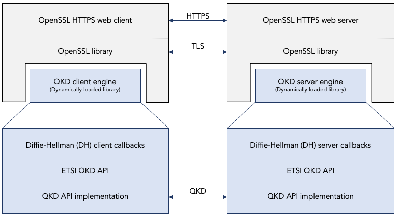
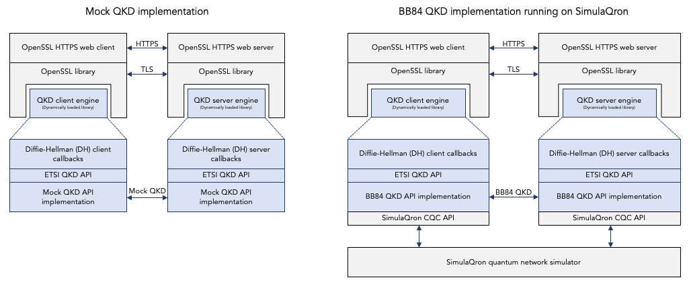
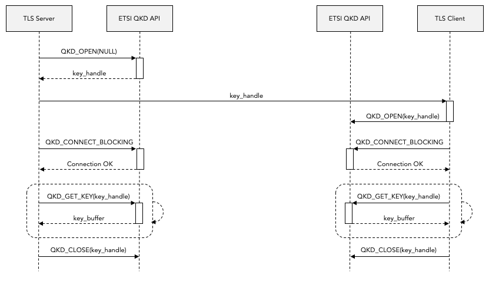

This is part 4 in a multi-part report describing how we implemented Quantum Key Distribution (QKD) in OpenSSL as part of the pan-European quantum Internet hackathon in Delft on 5 and 6 November 2019. See [the main page of this report](../README.md) for the other parts.  -- [Bruno Rijsman](https://www.linkedin.com/in/brunorijsman/)

# Implementing QKD in OpenSSL

## The RIPE quantum Internet hackathon challenge.

The work that we did to add [Quantum Key Distribution (QKD)](https://en.wikipedia.org/wiki/Quantum_key_distribution) support to [OpenSSL](https://www.openssl.org/) was based on the [OpenSSL integration challenge](https://github.com/PEQI19/PEQI-OpenSSL) that was designed by [Wojciech Kozlowski](https://www.linkedin.com/in/wojciech-kozlowski/) for the [Pan-European Quantum Internet Hackathon](https://labs.ripe.net/Members/ulka_athale_1/take-part-in-pan-european-quantum-internet-hackathon) hosted at [QuTech](https://qutech.nl/) at the [Delft University of Technology](https://www.tudelft.nl/) on 5 and 6 November, 2019.

The challenge consists of two parts:

 1. Add QKD support to OpenSSL by invoking the [ETSI KQD API](https://www.etsi.org/deliver/etsi_gs/QKD/001_099/004/01.01.01_60/gs_QKD004v010101p.pdf). Here OpenSSL becomes a consumer of the QKD API. The hackathon organizers had provided a mock implementation of the QKD API for testing purposes.

 2. Implement a specific QKD protocol, namely BB84, on top of the SimulaQron quantum network simulator. Here the BB84 implementation becomes a provider of the QKD API.

The end-goal of the challenge is to use an off-the-shelf browser (e.g. Chrome) and connect it to a secure HTTPS website hosted on an off-the-shelf web server (e.g. Apache), while using the BB84 quantum key distribution algorithm as the key agreement protocol (running a [SimulaQron](http://www.simulaqron.org/) simulated quantum network), instead of the classical Diffie-Hellman protocol that is normally used in classical networks.

During the hackathon, the team that I was a part of worked on part 1 of the challenge. This page describes that work (which was successfully completed). Another team ("team awesome") worked on part 2 of the challenge, which they partially completed. The end-goal (i.e. the integration between part 1 and 2) was not yet achieved. It is my intention to complete the work for part 2, to complete the integration, and to update this document once that work is completed.

## Two approaches to adding QKD support to OpenSSL.

There are two approaches to adding support for QKD in OpenSSL using the ETSI QKD API:
 * Hacking the existing engine-based extension mechanism for Diffie-Hellman.
 * Introducing QKD as a new first-class key exchange protocol.

#### Approach 1: Hacking the existing engine-based extension mechanism for Diffie-Hellman.

OpenSSL has a mechanism, called "engines", that allows third parties (such as myself) to add extensions to OpenSSL. These extensions can be implemented as dynamic libraries (.so files on Linux or .dylib files on macOS) which allows the extensions to be dynamically loaded into OpenSSL without make any changes to the source code of OpenSSL itself. The OpenSSL configuration file controls which extensions are loaded into OpenSSL.

The main purpose of OpenSSL engines to allow time-consuming cryptographic operations to be offloaded from the default software implementation in OpenSSL into special-purpose crypto acceleration hardware. OpenSSL has made some a-priori decisions about which operations make sense to be offloaded. The OpenSSL engine framework provides APIs to allow those specific operations, and only those specific operations, to be offloaded. 

The engine APIs allow the dynamically loaded engine to register a callback function that OpenSSL should call whenever a particular expensive operations needs to be performed. This registered function is called instead of the default software implementation in OpenSSL, and it is expected to implement the same function in a more efficient manner on special-purpose hardware.

In our current implementation of QKD support in OpenSSL, we have used the engine mechanism in a creative way to avoid having to change the OpenSSL source code (see approach 2 below). A less charitable way of saying it is that our current implementation is a hack. 

Our QKD engine overloaded two callback functions that were really intended to implement hardware acceleration for the Diffie-Hellman (DH) key exchange algorithm:

* The Diffie-Hellman `compute_key` engine callback is really intended to choose a Diffie-Hellman private key and to compute the corresponding public key, using the negotiated Diffie-Hellman g and p parameters. We have hacked this callback and we have hijacked the public key to instead communicate an ETSI QKD `key_handle` from the QKD server to the QKD client.

* The Diffie-Hellman `generate_key` engine callback is really intended to generate a Diffie-Hellman shared secret using the end-point's own private key, the peer's public key, and the negotiated Diffie-Hellman g and p parameters. We have hacked this callback to instead retrieve the shared secret from the QKD key management layer using the ETSI QKD GET_KEY API.

The following diagram illustrates this first approach of hacking the existing engine-based extension mechanism for Diffie-Hellman. A more detailed description of the actual code is given below.

#### Approach 2: Introducing QKD as a new first-class key exchange protocol.

As a result of how engines are implemented in OpenSSL (see the description above), OpenSSL engines have their limitations. They can only be used to accelerate a pre-determined set of operations in existing crypto algorithms. They cannot be used to introduce, for example, a completely new key exchange algorithms such as QKD.

We got away with introducing QKD support without changing the OpenSSL source code by "hacking" the Diffie-Hellman engine as summarized above. Admittedly, this is not the proper way to implement QKD. The resulting code is ugly and fragile (see the [challenges section](encountered-challenges-and-their-solutions) below for more details)). The proper thing to do would have been to change the OpenSSL code to introduce QKD as a first-class abstraction in OpenSSL. We would still need an engine (for QKD, not for "fake" Diffie-Hellman) because the QKD provider is typically some external device reached through the ETSI API.

Who knows, maybe sometime in the future in some remote South-America town, I will find myself with some spare time on my hands, do a "proper" implementation, and update this repository and report accordingly.

## Mock QKD versus BB84 QKD running on SimulaQron

The plan of attack for the hackathon was to split the work across two teams:

 * One team would work on implementing an engine for OpenSSL to consume the ETSI QKD API for doing an QKD-based key exchange in OpenSSL. This was the team that I was a part of.

 * Another team would work on implementing the ETSI QKD API by implementing the BB84 QKD protocol on top of the SimulaQron quantum network simulator using the SimulaQron CQC API. (CQC is simply the name of the C-language binding of the API that is used to talk to SimulaQron).

Thus, whereas team 1 is a _consumer_ of the ETSI QKD API, team 2 is a _provider_ of the ETSI QKD API.

To allow the two teams to work in parallel, team 1 would initially use a "mock" implementation of the ETSI QKD API. This is shown on the left side in the diagram below. In this mock implementation there is a "fake" ETSI QKD API provider that simply allocates a random shared secret and send it "in the clear" over a TCP connection to the other side.

Once both team 1 and team 2 are finished, the two components (the consumer and the provider) can be integrated together as show on the right side in the diagram below.

At this point in time, we have only completed the left side of the diagram. The right side, i.e. the integration, has not yet been achieved. But I plan to complete that integration in the future and update this repository and this report accordingly.

## Hacking the OpenSSL Diffie-Hellman engine to add QKD.

This section describes in detail how we "hacked" the existing engine-based extension mechanism for Diffie-Hellman to add support for QKD in OpenSSL on top of the ETSI QKD API.

The following resources are helpful for understanding how engines work in OpenSSL in general and for understanding the code in this repository in specific:

 * [OpenSSL wiki main page](https://wiki.openssl.org/index.php/Main_Page)
 * [OpenSSL wiki libcrypto main page](https://wiki.openssl.org/index.php/Libcrypto_API)
 * [OpenSSL wiki Diffie-Hellman](https://wiki.openssl.org/index.php/Diffie_Hellman)
 * [OpenSSL wiki example ECDH engine](https://wiki.openssl.org/index.php/Creating_an_OpenSSL_Engine_to_use_indigenous_ECDH_ECDSA_and_HASH_Algorithms)
 * [OpenSSL wiki SSL and TLS tutorial](https://wiki.openssl.org/index.php/SSL_and_TLS_Protocols)
 * [OpenSSL man page for engines](https://www.openssl.org/docs/man1.1.0/man3/ENGINE_add.html)
 * [OpenSSL man page for DH_generate_key engine callback](https://www.openssl.org/docs/man1.1.0/man3/DH_generate_key.html)
 * [OpenSSL man page for DH_compute_key engine callback](https://www.openssl.org/docs/man1.1.0/man3/DH_compute_key.html)
 * [Gost-engine/engine GitHub repo containing an OpenSSL engine implementation](https://github.com/gost-engine/engine)

The following diagram shows how the ETSI QKD API is intended to be used (see section 6.1.1. of the [ETSI API](https://www.etsi.org/deliver/etsi_gs/QKD/001_099/004/01.01.01_60/gs_qkd004v010101p.pdf) for details):

We had to create separate engines for the HTTPS/TLS server and the HTTP/TLS client. TODO

The following files contain our implementation of the OpenSSL engine for QKD:

 * `qkd_engine_common.c` and `qkd_engine_common.h` 

Note that this engine code doesn't know or care whether the QKD implementation is (a) a mock QKD implementation or (b) an implementation of real BB84 QKD running on a simulated quantum network using SimulaQron or even (c) implementation of real QKD running over a real quantum network running some commercially available real QKD device.

TODO

## The mock implementation of the ETSI QKD API.

This sections describes in details on we created a "mock" (i.e. fake) implementation of the ETSI QKD API that allows us to test OpenSSL QKD without using any quantum network (neither a real quantum network nor a simulated quantum network).

TODO

## Encountered challenges and their solutions.

TODO

## How to build and run the code in this repository.

The code in the repository as been tested on Apple macOS and on Ubuntu Linux 18.04 LTS in an Amazon Web Services (AWS) instance.

The instructions for installing, building, and running the code on Ubuntu Linux 18.04 LTS in an AWS instance as as follows:

#### 1. Create and prepare an AWS Ubuntu instance

1.1. Launch an Ubuntu Linux 18.04 LTS instance in AWS using the default parameters. A t2.tiny instance is sufficient. 

1.2. SSH login to the instance (the default username for AWS Ubuntu instances is "ubuntu").
~~~
ssh -i <your-private-key-file.pem> ubuntu@<ip-address-of-your-aws-instance>
~~~

1.3. Install the build essentials:
~~~~
sudo apt-get update
sudo apt-get install -y build-essential
~~~~

1.4. Install Python:
~~~
sudo apt-get install -y python
~~~

#### 2. Install and build tshark (and wireshark)

Installing tshark is kind of a hassle. We can't use `apt-get` because it installs version 2.x of tshark; we need version 3.x of wireshark.

These steps also install wireshark, which we don't need for the Makefile, but it is handy to have it if you are running on a desktop Ubuntu.

Thanks to [Consent Factory](https://www.consentfactory.com/install-wireshark-3-0-1-ubuntu-18-04/) for describing the installation steps.

2.1. Install the dependencies for tshark (this is all one long line):
~~~
sudo apt-get install -y build-essential pkg-config ninja-build bison flex qt5-default qttools5-dev-tools qtcreator ninja-build libpcap-dev cmake libglib2.0-dev libgcrypt20-dev qttools5-dev qtmultimedia5-dev libqt5svg5-dev
~~~

2.2. Create the Wireshark group and add yourself to the group:
~~~
sudo groupadd -g 62 wireshark
sudo usermod -a -G wireshark ubuntu
~~~

2.3. Grab and extract the wireshark version 3.0.6 tarball:
~~~
cd ~
wget https://www.wireshark.org/download/src/all-versions/wireshark-3.0.6.tar.xz
~~~

2.4. Extract the tarball and move into the directory:
~~~
tar xf wireshark-3.0.6.tar.xz
cd wireshark-3.0.6
~~~

2.5. Build the tshark and wireshark applications. This will take a whopping 20 minutes or so, so grab a cup of coffee...
~~~
mkdir build &&
cd build &&
cmake -DCMAKE_INSTALL_PREFIX=/usr \
-DCMAKE_BUILD_TYPE=Release \
-DCMAKE_INSTALL_DOCDIR=/usr/share/doc/wireshark-3.0.6 \
-G Ninja \
.. &&
ninja
~~~

2.6. Install the built wireshark application:
~~~
sudo ninja install &&
sudo install -v -m755 -d /usr/share/doc/wireshark-3.0.6 &&
sudo install -v -m644 ../README.linux ../doc/README.* ../doc/{*.pod,randpkt.txt} \
/usr/share/doc/wireshark-3.0.6 &&
pushd /usr/share/doc/wireshark-3.0.6 &&
for FILENAME in ../../wireshark/*.html; do
sudo ln -s -v -f $FILENAME .
done &&
popd
unset FILENAME
~~~

2.7. Secure the application directories:
~~~
sudo chown -v ubuntu:wireshark /usr/bin/{tshark,dumpcap} &&
sudo chmod -v 6550 /usr/bin/{tshark,dumpcap}
~~~

2.8. Allow tshark to capture interface traffic. Answer "yes" to the pop-up question "Should non-superusers be able to capture packets?"
~~~
sudo dpkg-reconfigure wireshark-common
~~~

#### 3. Install and build OpenSSL

Technically, we don't need to install the OpenSSL source code. The OpenSSL engine mechanism allows us to dynamically load an engine shared library into the OpenSSL binary that is already installed on the instance. Still, we install the OpenSSL source code since reading the source code is essential to understanding how OpenSSL works, and because we will end up changing the OpenSSL source code if and when we introduce QKD as a first-class key exchange protocol at some point in the future.

3.1. Clone OpenSSL from GitHub into the home directory of your AWS instance:
~~~
cd ~
git clone https://github.com/openssl/openssl.git
~~~

3.2. Configure and build the cloned OpenSSL code. Expect the `make` step to take about 5 minutes. Expect the `make test` step to take a bit more than 2 minutes. A few test cases (md2, rc5, gost, etc.) will be skipped, but all other test cases should report "ok". Do **not** run `make install` (we don't want to overwrite the default OpenSSL library).
~~~
cd ~/openssl
./config
make
make test
~~~

#### 4. Install, build, and run openssl-qkd

4.1. Clone openssl-qkd from GitHub into the home directory of your AWS instance:
~~~
cd ~
git clone https://github.com/brunorijsman/openssl-qkd.git
~~~

4.2. Build the openssl-qkd code:
~~~
cd ~/openssl-qkd
make
~~~

4.3. Run the openssl-qkd test:
~~~
cd ~/openssl-qkd
make test
~~~

You should see the following at the end out the output:
~~~
Checking tshark output for correct Diffie-Helman exchange... OK
~~~

**Congratulations!** You have successfully run a (mock) QKD key exchange between an HTTP client and an HTTP server using OpenSSL and the ETSI QKD API!

Note: currently the test sometimes fails with the following error message. This is a known issue that will be fixed (hopefully) soon. Just run the test again.
~~~~
Checking tshark output for correct Diffie-Helman exchange... Did not match pattern #0: Connection establish request \(SYN\): server port 44330
~~~~

## What does the mock QKD in OpenSSL unit test / demo do?

TODO